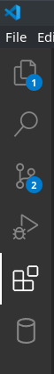

# Proyecto de CV online
Esto es un proyecto desarollado en respuesta a una actividad de clase pero sientete libre de usarlo como si fuera mi CV si te sirve de informacion sobre mi.
En cualquier caso aqui documentare como puedes abrir el curriculum y las funcionalidades de la pagina.

## Abrir el index.html
La pagina funcionara de forma muy limitada en los navegadores actuales por las politicas CORS y el hecho de que la pagina abre los JSON que vera en el repositorio.
Para poder abrirlo debera tener un servicio HTTP en su sistema donde hostear la pagina, una manera que puede usar es con el plugin de **visual studio code "live server"**
Aqui esta el link para la descarga de visual studio code:
- [Visual studio code](https://code.visualstudio.com/)
Para instalar la extension de live server debera ir al apartado plugins en el programa que deberia estar en el lado izquierdo de la pantalla.  
  
Luego pege lo siguiente en el buscador de plugins que se le debe de haber abierto:
- ritwickdey.LiveServer
Las instrucciones de uso deberia encontrarlo en la pagina del plugin cuando lo selecciono y con eso deberia poder abrir index.html.
## Tecnologias utilizadas
Aqui hay un listado de las tecnologias empleadas para efectuar la pagina.
- HTML
- CSS
- Javascript
- JQuery
- Bootstrap
- JSON